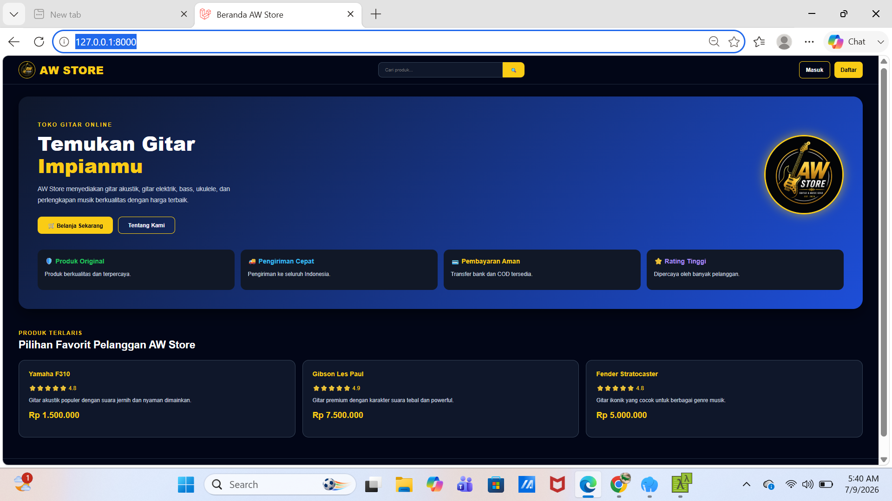
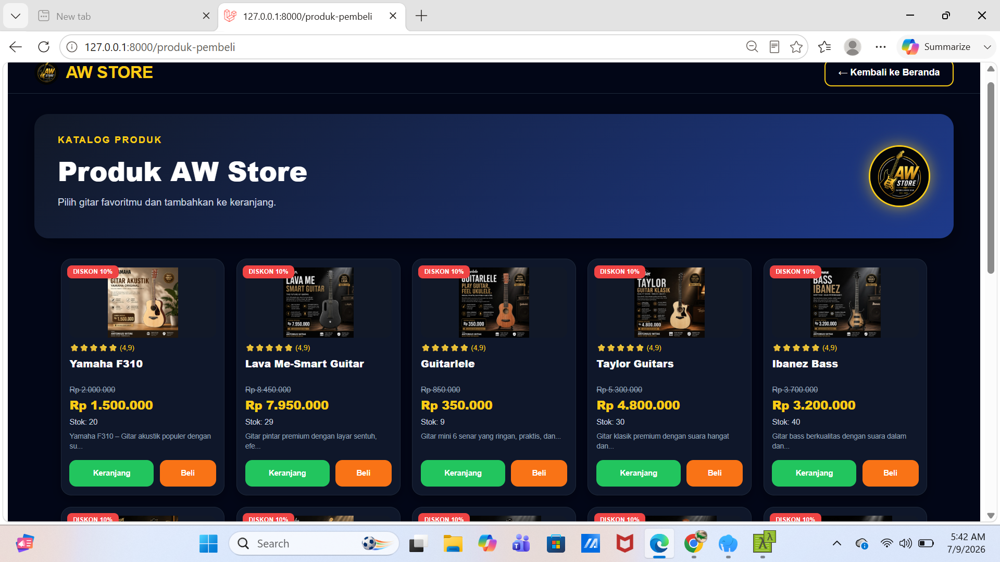
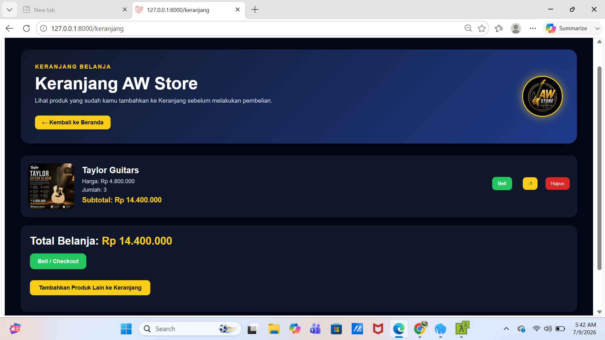
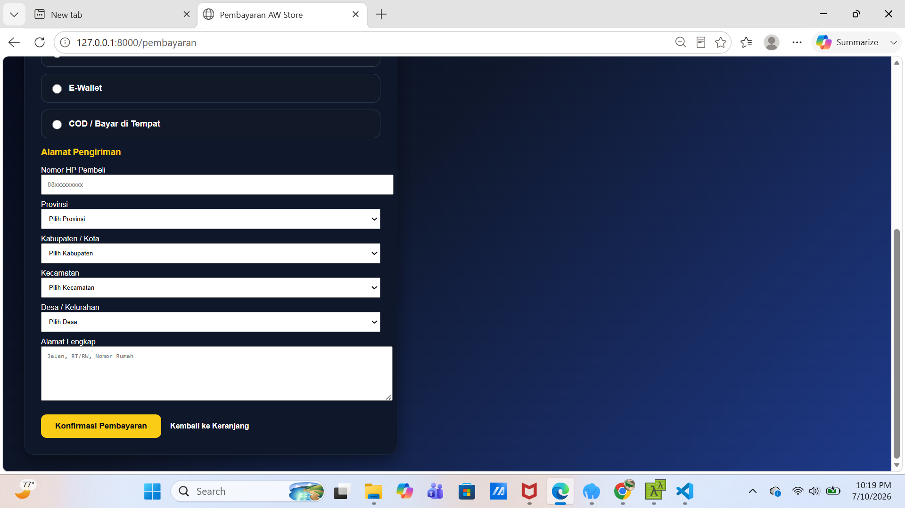
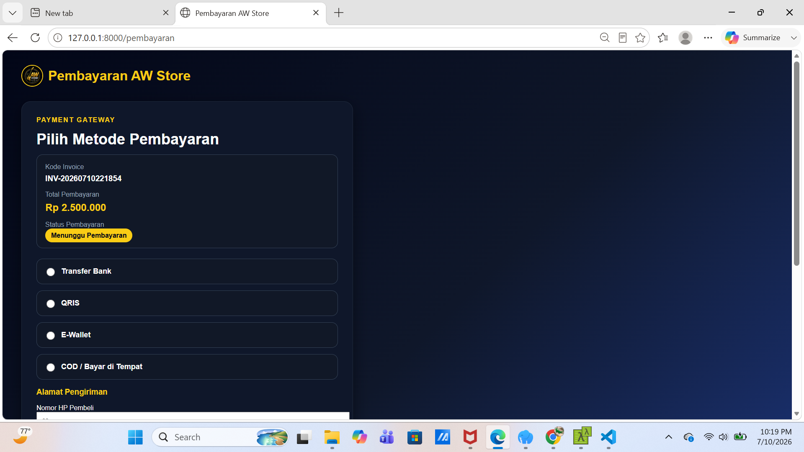
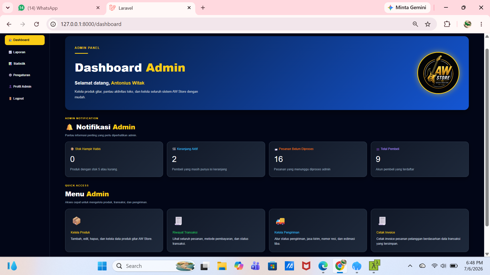
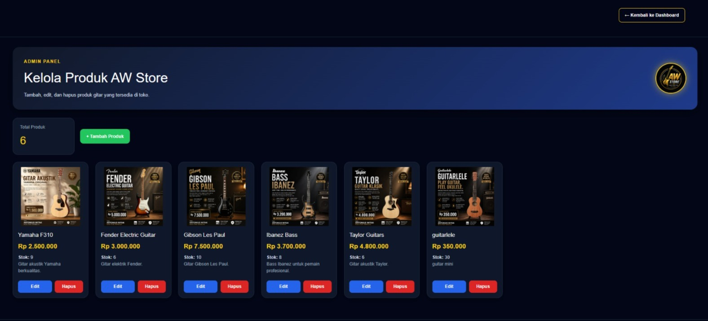
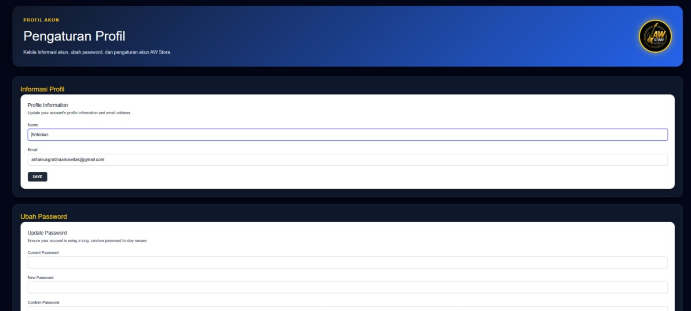

# 🎸 AW Store Template

Laravel E-Commerce Template with Admin and Customer Panel.

## 📌 Features

- Admin Dashboard
- Customer Dashboard
- Product Management
- Shopping Cart
- Checkout
- User Authentication
- Customer Profile
- Responsive Design

## 🛠️ Tech Stack

- Laravel
- PHP
- MySQL
- Blade
- Bootstrap
- HTML
- CSS
- JavaScript

## 🚀 Installation

bash
git clone https://github.com/awwebstudio/aw-store-template.git
cd aw-store-template

composer install

cp .env.example .env

php artisan key:generate

php artisan migrate

php artisan serve

## 📸 Screenshots

### Home

### Produk

### Keranjang

### Masukan Alamat

### Metode Pembayaran

### Dashboard Admin

### Kelola Produk

### Profil

## 👨‍💻 Developer

AW Web Studio

GitHub:
https://github.com/awwebstudio